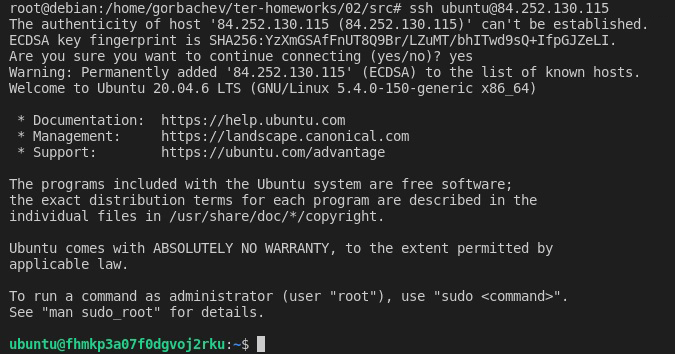
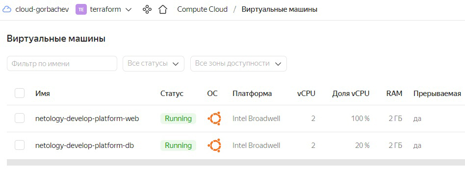
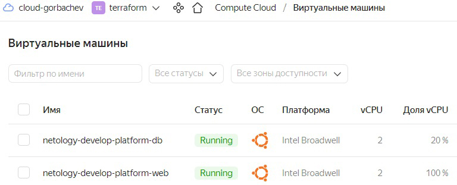

# Домашнее задание к занятию «Основы Terraform. Yandex Cloud» - `Горбачев Олег` 

### Задание 0

1. Ознакомьтесь с [документацией к security-groups в Yandex Cloud](https://cloud.yandex.ru/docs/vpc/concepts/security-groups?from=int-console-help-center-or-nav).
2. Запросите preview доступ к данному функционалу в ЛК Yandex Cloud. Обычно его выдают в течении 24-х часов.
https://console.cloud.yandex.ru/folders/<ваш cloud_id>/vpc/security-groups.   
Этот функционал понадобится к следующей лекции. 


### Задание 1

В качестве ответа всегда полностью прикладывайте ваш terraform-код в git.

1. Изучите проект. В файле variables.tf объявлены переменные для Yandex provider.
2. Переименуйте файл personal.auto.tfvars_example в personal.auto.tfvars. Заполните переменные: идентификаторы облака, токен доступа. Благодаря .gitignore этот файл не попадёт в публичный репозиторий. **Вы можете выбрать иной способ безопасно передать секретные данные в terraform.**
3. Сгенерируйте или используйте свой текущий ssh-ключ. Запишите его открытую часть в переменную **vms_ssh_root_key**.
4. Инициализируйте проект, выполните код. Исправьте намеренно допущенные синтаксические ошибки. Ищите внимательно, посимвольно. Ответьте, в чём заключается их суть.
5. Ответьте, как в процессе обучения могут пригодиться параметры ```preemptible = true``` и ```core_fraction=5``` в параметрах ВМ. Ответ в документации Yandex Cloud.

### Решение 1

1. Изучил проект, посмотрел variables.tf. Файл variables.tf нужен для того, чтобы определить типы переменных и при необходимости, установить их значения по умолчанию.

2. Переименовал файл personal.auto.tfvars_example в personal.auto.tfvars, заполнил переменные. Поскольку файл personal.auto.tfvars находится в .gitignore, то можно не опасаться утечки данных. Передавать секретные переменные можно и другими способами. Например, в секретной переменной можно указать ключ sensitive = true, тогда при выполнении ```terraform plan/apply/output/console``` его значение не будет выведено в консоль.

Также можно передавать секретные переменные в командной строке в ключе -var - ```terraform apply -var "token=***"```, использовать переменные окружения, предварительно их создав, например, командой export token=***, либо при выполнении ```terraform apply``` ссылаться на отдельный var файл вне рабочей директории проекта - ```terraform apply -var-file=~/.secret/private.tfvars```.

3. Создал короткий ssh ключ используя ```ssh-keygen -t ed25519```, записал его pub часть в переменную ***vms_ssh_root_key***.

4. Инициализировал проект, выполнил код. Нашел ошибки в блоке ***resource "yandex_compute_instance" "platform" {***.

Ошибки были следующие:

* В строке ***platform_id = "standart-v4"*** должно быть слово standard
* Версия v4 неправильная. Согласно документации Yandex.Cloud (https://cloud.yandex.ru/docs/compute/concepts/vm-platforms) платформы могут быть только v1, v2 и v3.
* В строке ***cores         = 1*** указано неправильное количество ядер процессора. Согласно документации Yandex.Cloud (https://cloud.yandex.ru/docs/compute/concepts/performance-levels) минимальное количество виртуальных ядер процессора для всех платформ равно двум.

После исправления ошибок удалось запустить код и создать виртуальную машину.

Исправленный блок ресурса выглядит следующим образом:


5. Параметр ```preemptible = true``` применяется в том случае, если нужно сделать виртуальную машину прерываемой, то есть возможность остановки ВМ в любой момент. Применятся если с момента запуска машины прошло 24 часа либо возникает нехватка ресурсов для запуска ВМ. Прерываемые ВМ не обеспечивают отказоустойчивость.

Параметр ```core_fraction=5``` указывает базовую производительность ядра в процентах. Указывается для экономии ресурсов.

Виртуальная машина успешно создана:


Подключение по протоколу SSH работает:


В качестве решения приложите: 
- скриншот ЛК Yandex Cloud с созданной ВМ,

   >    

- скриншот успешного подключения к консоли ВМ через ssh,

   >    

- ответы на вопросы - *в тексте задания выше*
---

### Задание 2

1. Изучите файлы проекта.
2. Замените все "хардкод" **значения** для ресурсов **yandex_compute_image** и **yandex_compute_instance** на **отдельные** переменные. К названиям переменных ВМ добавьте в начало префикс **vm_web_** .  Пример: **vm_web_name**.
   > ```bash
   >  data "yandex_compute_image" "ubuntu" {
   >    family = var.vm_web_image_name
   >    }
   >    
   >    resource "yandex_compute_instance" "platform" {
   >      name        = var.vm_web_instance_name
   >      platform_id = "standard-v1"
   >      resources {
   >      cores         = var.vm_web_cores
   >      memory        = var.vm_web_memory
   >      core_fraction = var.vm_web_core_fraction  
   >      }
   >      ```
3. Объявите нужные переменные в файле variables.tf, обязательно указывайте тип переменной. Заполните их **default** прежними значениями из main.tf. 
   > ```bash
   > ### yandex_compute_image vars
   > 
   > variable "vm_web_image_name" {
   >   type        = string
   >   default     = "ubuntu-2004-lts"
   >   description = "release_name_of_image"
   > }
   > 
   > ### yandex_compute_instance vars
   > 
   > variable "vm_web_instance_name" {
   >   type        = string
   >   default     = "netology-develop-platform-web"
   >   description = "name_of_instance"
   > }
   > 
   > variable "vm_web_cores" {
   >   type        = number
   >   default     = 2
   >   description = "count_of_cores_vm"
   > }
   > 
   > variable "vm_web_memory" {
   >   type        = number
   >   default     = 2
   >   description = "count_of_memory_vm"
   > }
   > 
   > variable "vm_web_core_fraction" {
   >   type        = number
   >   default     = 100
   >   description = "core_fraction_of_vm"
   > }
   > ```

4. Проверьте terraform plan (изменений быть не должно). 
   > ```bash
   > oot@debian:/home/gorbachev/ter-homeworks/02/src# terraform plan
   > yandex_vpc_network.develop: Refreshing state... [id=enp5sviqjetfu9buhd22]
   > yandex_vpc_subnet.develop: Refreshing state... [id=e9brln1338q1s5hokufh]
   > yandex_compute_instance.platform: Refreshing state... [id=fhm23msti5eq166tcipo]
   > 
   > Note: Objects have changed outside of Terraform
   > ```
   ---
   
### Задание 3

1. Создайте в корне проекта файл 'vms_platform.tf' . Перенесите в него все переменные первой ВМ.
2. Скопируйте блок ресурса и создайте с его помощью вторую ВМ(в файле main.tf): **"netology-develop-platform-db"** ,  cores  = 2, memory = 2, core_fraction = 20. Объявите ее переменные с префиксом **vm_db_** в том же файле('vms_platform.tf').
3. Примените изменения.

   >    

---

### Задание 4

1. Объявите в файле outputs.tf output типа map, содержащий { instance_name = external_ip } для каждой из ВМ.
2. Примените изменения.

В качестве решения приложите вывод значений ip-адресов команды ```terraform output```

   > ```bash
   > root@debian:/home/gorbachev/ter-homeworks/02/src# terraform output
   > db_instance_public_ip = "158.160.39.211"
   > web_instance_public_ip = "158.160.104.47"
   > ```

### Задание 5

1. В файле locals.tf опишите в **одном** local-блоке имя каждой ВМ, используйте интерполяцию ${..} с несколькими переменными по примеру из лекции.
2. Замените переменные с именами ВМ из файла variables.tf на созданные вами local переменные.
3. Примените изменения.

   > *Если я правильно понял задание, то:*
   > 1. Заполнил **locals.tf**
   > ```bash
   > locals {
   >   org      = "netology"
   >   project  = "develop"
   >   instance = "platform"
   > }
   > ```
   > 2. Указал имён ВМ при помощи local переменных (причем указывал я их уже в `main.tf`, так как в `variables` переменные не указать)
   > ```bash
   > name = "${ local.org }-${ local.project }-${ local.instance }-web"
   >   ```
   >   ```bash
   > name = "${ local.org }-${ local.project }-${ local.instance }-db"
   > ```
   > 3. Пересоздал инфраструктуру. Имена инстансов на месте:
   >    

### Задание 6

1. Вместо использования 3-х переменных  ".._cores",".._memory",".._core_fraction" в блоке  resources {...}, объедените их в переменные типа **map** с именами "vm_web_resources" и "vm_db_resources".

   > *Переменные типа `map`:*
   > ```bash
   > variable vm_db_resources {
   >   type = map
   >   default = {
   >     cores = 2
   >     memory = 4
   >     core_fraction = 20
   >   }
   > }
   > 
   > variable vm_web_resources {
   >   type = map
   >   default = {
   >     cores = 2
   >     memory = 4
   >     core_fraction = 100
   >   }
   > }
   > ```
   > 
   > *Новый вид блока `resources` (на примере `vm_db_`):*
   > ```bash
   >   resources {
   >     cores         = var.vm_db_resources["cores"]
   >     memory        = var.vm_db_resources["memory"]
   >     core_fraction = var.vm_db_resources["core_fraction"]
   > ```    

2. Так же поступите с блоком **metadata {serial-port-enable, ssh-keys}**, эта переменная должна быть общая для всех ваших ВМ.

   > *В `variables.tf` прямо указал данные для авторизации на ВМ по ssh:*
   > ```bash
   > variable auth-ssh {
   >   type = map
   >   default = {
   >    serial-port-enable = 1 
   >    ssh-keys = "ubuntu:ssh-rsa AAAAB3.................AqNVz gorbachev@debian"
   >   }
   > }
   > ```
   > *A в `main.tf` сослался на переменную `metadata = var.auth-ssh`*

3. Найдите и удалите все более не используемые переменные проекта.
4. Проверьте terraform plan (изменений быть не должно).

   > *Результат `terraform plan`:*
   > ```bash
   > root@debian:/home/gorbachev/ter-homeworks/02/src# terraform plan
   > yandex_vpc_network.develop: Refreshing state... [id=enpj1umoldup8i9rplsk]
   > yandex_vpc_subnet.develop: Refreshing state... [id=e9b2lb0j25ug7g5gitjm]
   > yandex_compute_instance.platform-db: Refreshing state... [id=fhmjigjf75lm3u30mvfi]
   > yandex_compute_instance.platform: Refreshing state... [id=fhm0q0d1v5rivvjfpbg5]
   > 
   > Note: Objects have changed outside of Terraform
   > ```
